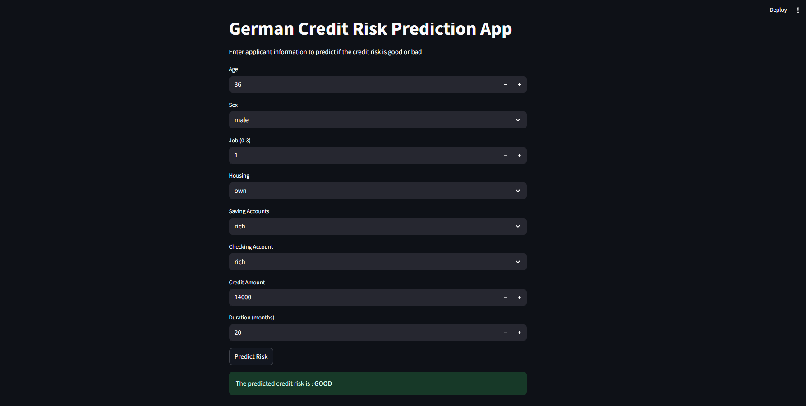

# Credit Risk Prediction App  

A machine learning project that predicts **credit risk** (Good/Bad) using the **German Credit Dataset** from Kaggle.  
The model is built with **XGBoost** and integrated into an interactive **Streamlit web app** for easy predictions.  

---

## 🚀 Project Workflow  
1. **Data Preprocessing**  
   - Loaded dataset from Kaggle (German Credit Risk dataset).  
   - Handled missing values (dropped for this version).  
   - Encoded categorical features with `LabelEncoder`.  
   - Performed data visualization (boxplots, violin plots, heatmaps, etc.).  

2. **Modeling**  
   - Trained and evaluated multiple models:  
     - Decision Tree  
     - Random Forest  
     - Extra Trees  
     - XGBoost (Best Model)  
   - Tuned hyperparameters using GridSearchCV.  
   - Final model achieved:  
     - **Accuracy:** ~67%  
     - **Precision & Recall balanced** (better for risk prediction).  

3. **Deployment / Integration**  
   - Saved model and encoders using `joblib`.  
   - Built a **Streamlit app** for real-time prediction.  
   - Users can input applicant details (age, job, accounts, credit, etc.) and get instant risk classification.  

---

## 📊 Results (XGBoost)  
- **Accuracy:** 67.6%  
- **Confusion Matrix:**  
  - Good Risk correctly identified ~73%  
  - Bad Risk correctly identified ~61%  

---

## 🖥️ Tech Stack  
- **Python** (pandas, numpy, scikit-learn, xgboost)  
- **Streamlit** (web app interface)  
- **Matplotlib / Seaborn** (visualizations)  
- **Joblib** (model persistence)  

---

## 📸 App Preview  
  

---

## ⚡ How to Run Locally  

```bash
# Clone the repo
git clone https://github.com/himanshu-shekhar2327/credit-risk-prediction.git
cd credit-risk-prediction

# Install dependencies
pip install -r requirements.txt

# Run the Streamlit app
streamlit run app.py


👨‍💻 Author

Himanshu Shekhar – Enthusiast Data Scientist and ML Engineer

📧 Contact: himanshu.shekhar0505@gmail.com

🌐 LinkedIn: https://www.linkedin.com/in/himanshu-shekhar-8a037a233/